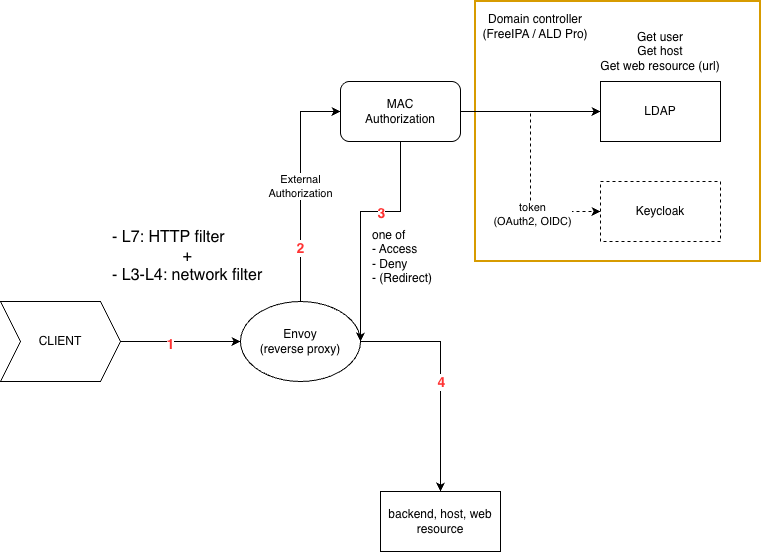
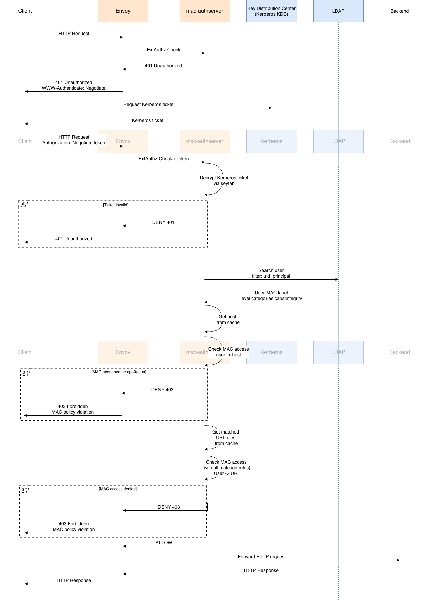
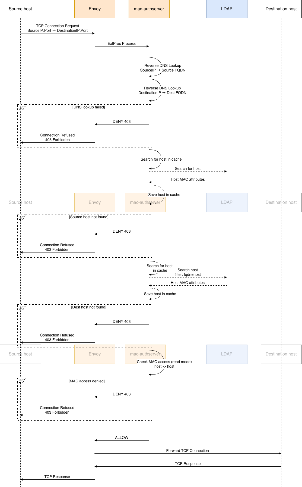

# Дизайн системы

## Overview

## Компоненты

### Envoy
Open source обратный прокси-сервер.

https://www.envoyproxy.io/

### mac-authserver

Сервис авторизации. Представляет из себя gRPC сервер, разработанный на языке программирования Golang.

Реализует два API Envoy:
  - **External Authorization API v3** - авторизация L7/HTTP трафика
  - **External Processing API v3** - авторизация L3-L4 трафика
Данные для авторизации берет из локального кэша. Кэш обновляется каждые N секунд. Подробнее про кэш:

#### Кэш политик MAC

Сервис хранит все данные, необходимые для авторизации, в in-memory кэше ([`cache.Store`](../src/infrastructure/cache/store.go)). Это позволяет обрабатывать запросы авторизации без обращения к LDAP на каждый запрос.

**Жизненный цикл кэша:**

1. **Инициализация** — при старте сервиса выполняется синхронная загрузка данных из LDAP ([`loadSnapshot()`](../src/infrastructure/cache/loader.go:67)). Если первичная загрузка завершается с ошибкой, сервис не запускается.
2. **Фоновое обновление** — после успешной инициализации запускается фоновая горутина ([`refreshLoop()`](../src/infrastructure/cache/store.go:53)), которая перезагружает данные из LDAP каждые `cache_ttl_seconds` секунд (по умолчанию — 1800 сек / 30 мин, настраивается в `config.json` → `ldap.cache_ttl_seconds`).
3. **Отказоустойчивость** — если фоновое обновление завершается с ошибкой, сервис продолжает работать со старыми (stale) данными и логирует ошибку. Следующая попытка обновления произойдёт через TTL.

**Механизм атомарной подмены (lock-free reads):**

Кэш использует паттерн *immutable snapshot + atomic swap*. Все данные хранятся в неизменяемой структуре [`snapshot`](../src/infrastructure/cache/loader.go:32), указатель на которую подменяется атомарно через `atomic.StorePointer` / `atomic.LoadPointer`. Благодаря этому:
- читатели (горутины обработки запросов) **никогда не блокируются** писателем;
- писатель (горутина обновления) **никогда не блокируется** читателями;
- отсутствуют мьютексы на горячем пути авторизации.

**Структура snapshot:**

Каждый snapshot содержит:

| Поле | Тип | Описание |
|------|-----|----------|
| `hosts` | [`*HostTrie`](../src/infrastructure/cache/host_trie.go:33) | Trie-дерево по FQDN хостов. Хранит метки безопасности хостов (`HostSecurityContext`) и bitset привязанных URI-правил. Поиск за O(количество меток домена). |
| `uriTrie` | [`*URITrie`](../src/infrastructure/cache/uri_trie.go:31) | Trie-дерево по сегментам URI-пути. Хранит правила типов `exact` и `prefix`. Поиск за O(количество сегментов пути). |
| `regexRules` | `[]*CachedURIRule` | Плоский список URI-правил с типом `regex`. Проверяются линейно, но только для правил, привязанных к запрашиваемому хосту (фильтрация через bitset). |
| `allRules` | `[]*CachedURIRule` | Плоский массив всех URI-правил, индексированный по `RuleID`. Обеспечивает O(1) доступ к правилу по идентификатору. |

**Источники данных (LDAP):**

При загрузке snapshot выполняются два LDAP-запроса:
1. **URI MAC-правила** — `(objectClass=aldURIMACRule)` — загружаются все правила с атрибутами: путь (`x-ald-uri-path`), тип совпадения (`x-ald-uri-match-type`), метка MAC (`x-ald-uri-mac`), категории целостности (`x-ald-uri-mic-level`), привязки к сервисам (`x-ald-uri-service-ref`).
2. **Хосты** — `(x-ald-host-mac=*)` — загружаются все хосты с MAC-метками и категориями целостности (`x-ald-host-mic-level`).

**Алгоритм поиска URI-правил ([`MatchingURIRules()`](../src/infrastructure/cache/store.go:102)):**

1. По FQDN хоста находится `HostRuleSet` — bitset идентификаторов правил, привязанных к этому хосту.
2. По URI-пути запроса обходится `URITrie` — собирается `PrefixRuleSet` (объединение prefix- и exact-совпадений).
3. Линейно проверяются regex-правила, но **только те**, чей ID присутствует в `HostRuleSet`.
4. `MatchedUriRuleSet = PrefixRuleSet ∪ RegexRuleSet`.
5. `ActiveRuleSet = HostRuleSet ∩ MatchedUriRuleSet`.
6. Для каждого правила из `ActiveRuleSet` возвращается `URISecurityContext`.

**Fallback на LDAP:**

Если хост не найден в кэше, [`GetHostSecurityContext()`](../src/application/usecase/common.go:78) выполняет прямой LDAP-запрос как fallback. Это обеспечивает корректную работу для хостов, добавленных между обновлениями кэша.

Логика авторизации происходит по мандатной модели управления доступом (см. [подробнее про авторизацию](./access.md)).

### LDAP (служба каталогов)
Служба каталогов контроллера домена, предоставляющая **централизованное хранилище информации** о пользователях, группах и других объектах домена. 

В проекте используется для получения дополнительных атрибутов (в частности, меток конфиденциальности) пользователей, узлов или других объектов/субъектов доступа после успешной Kerberos-аутентификации.

https://www.freeipa.org/page/HowTo/LDAP

## Диаграммы последовательности

### Авторизация HTTP (L7)

### Авторизация transport (L3-L4)

